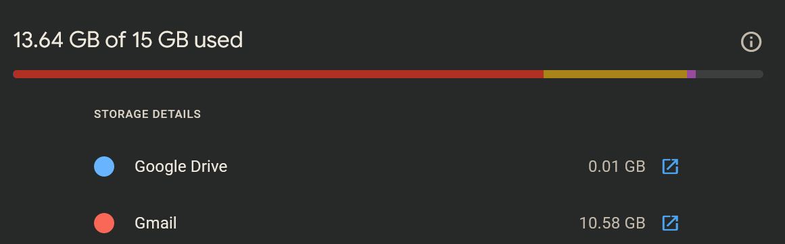

# Gmail compacter [WIP]

## Use case
Email is used for far too much. I have come to rely on being able to find anything that has ever hit my email by searching my inbox. Google started combining storage limits across various services under one account, and [discontinuing unlimited free storage](https://www.cnet.com/tech/services-and-software/google-photos-unlimited-free-storage-is-gone-heres-how-to-get-more-space/) as part of other services to sell GoogleOne storage.

This project aims to optimize Gmail usage, while retaining 99% of the functionality we have to rely on from our inbox.

## Intents and goals
- Reduce the total storage used by gmail
- Preserve searchability of information
- Preserve key data from email information (eg: order #s, email dates, etc)
- Index large attachments and link to exported/external storage

